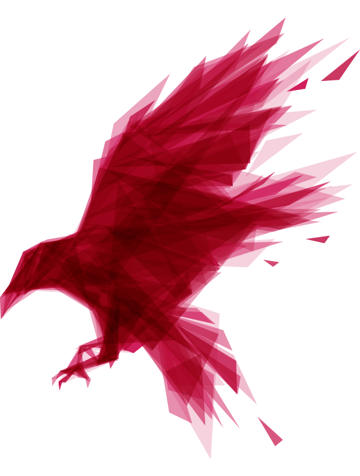
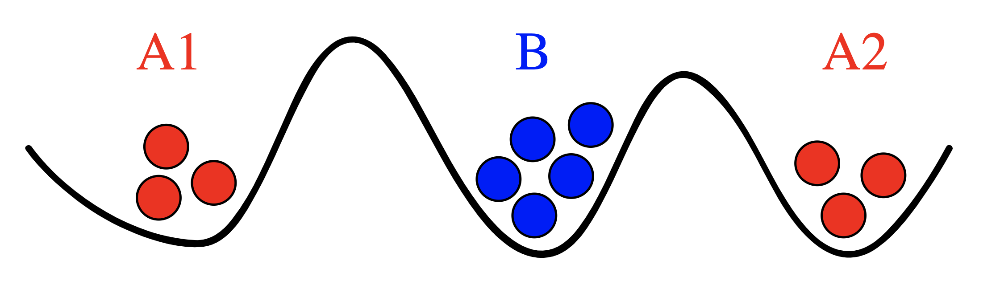
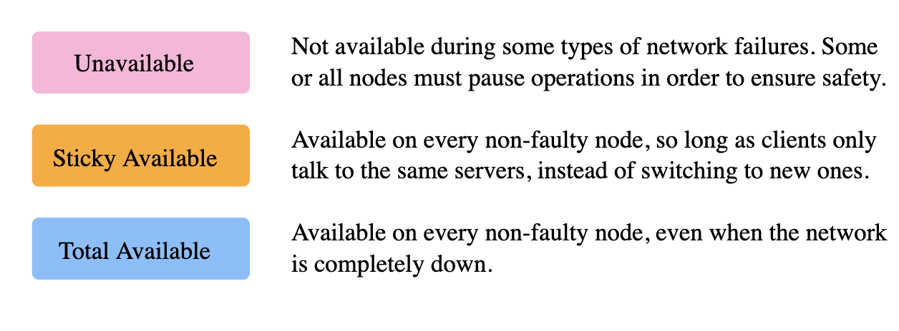
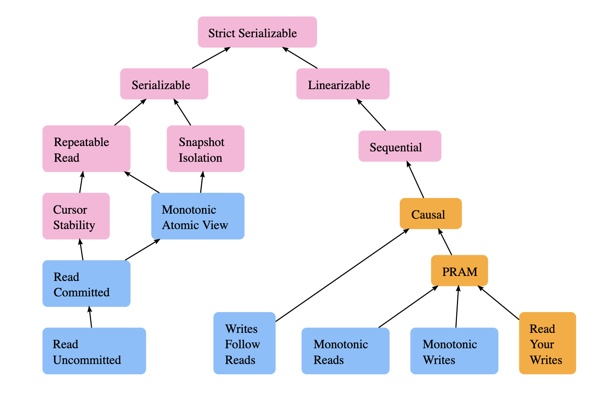

<!--
$size: 16:9
-->

# RavenDB - a cloud native Document Database

# 

##### Bitkom AK Software Engineering, Frankfurt 23.05.2019
###### Johannes Rudolph ( [jrudolph@meshcloud.io](mailto:jrudolph@meshcloud.io) )

---

<!--
page_number: true
$theme: gaia
template: invert
footer:  Bitkom AK Software Engineering, Frankfurt 23.05.2019
-->

## What's a cloud-native database, anyway?

---

## What do developers and architects want? 

- **resilience**: In the cloud, database nodes are cattle, not pets
- **scalable**: adding more nodes increases performance
- **distributed first**, not an after-thought
  - "topology-aware"
  - embrace distributed system challenges 
  - application can make informed tradeofs (CAP)

---

## Byzantine Generals Problem

# 

- [Two Generals Problem](https://en.wikipedia.org/wiki/Two_Generals%27_Problem): A1 and A2 must coordinate to attack B using messengers
- prooved to be unsolvable: no way to reach consensus

---

## CAP Theorem

Properties of a distributed system:
- Consistency
- Availability
- Partition Tolerance

<br>

> #### We want three, but can only pick two
---

<!--
$theme: default
-->

## Consistency Models: [jepsen.io/consistency](https://jepsen.io/consistency)



---

<!--
$theme: default
template: default
-->

# 

---

<!--
$theme: gaia
template: invert
-->

## RavenDB History I

- Started as an OSS Project ~ 2008, initial Release ~2010
- Ayende, contributor to NHibernate ORM (.NET port of Hibernate) 
- Uses Lucene indexes (ElasticSearch, Solr)
- .NET only, implemented in C#, storage based on ESENT 
<br>
> *[Why?](https://ayende.com/blog/4499/why-raven-db): Raven is an OSS (with a commercial option) document database for the .NET/Windows platform.
> (...) Raven is build by .NET developers for .NET developers.*

---

## RavenDB History II

#### RavenDB 4.0 is a cloud-native document database

- runs on .NET Core: Linux, Docker Images...
- *distributed first*: RavenDB always comes clustered
- *performant*: Voron storage engine, 
- Open Source + Commercial Licensing: AGPL Server, MIT Clients

---

## Domain Modeling with RavenDB

Doucment DB's work great with Domain Driven Design (DDD) Architectures

#### Aggregate Root = Document

```json
employees/1:
{
    "LastName": "Suyama",
    "FirstName": "Michael",
    "Title": "Sales Representative",
    "Address": {
        "Line1": "Coventry House\r\nMiner Rd.",
        "Line2": null,
     ...
```

---

## Domain Modeling with RavenDB

RavenDB works great with CQRS Architectures (Command-Query Ressponsibility Segregation)

- **ACID** commands on documents by id
  - ACID: Atomicity, Consistency, Isolation, Durability) 
  - multi-document transactions are the default
- **BASE** queries on map/reduce indices
  - BASE (Basically Available, Soft state, Eventual consistency) 
  - seperate read from write model: projections, stored index fields...
  
---

# Demo with RavenDB Studio

# 

---

## Productivity Features (in demo)

- full text search: powered by Lucene
-  map/reduce indices: pre-aggregated queries
- revisions: audit logs, document expiration etc.
- patch: update documents server side using javascript
- streams: stream query results
- subscriptions: reliable at least once processing
- multi-model: graph queries, spatial queries, faceted queries, suggestions etc.

---

## Productivity Features - Testability

```csharp
public void MyFirstTest() {
    using (var store = GetDocumentStore()) {
        store.ExecuteIndex(new TestDocumentByName());
        using (var session = store.OpenSession()) {
            session.Store(new TestDocument { Name = "Hello world!" });
            session.Store(new TestDocument { Name = "Goodbye..." });
            session.SaveChanges();
        }
        WaitForIndexing(store); 
        using (var session = store.OpenSession()) {
            var query = session
              .Query<TestDocument, TestDocumentByName>()
              .Where(x => x.Name == "hello")
              .ToList();
            Assert.Single(query);
        ...
```

---

## Cluster Replication

#### By default RavenDB is AP: available + partition tolerant

- writes + reads possible at any node
- async, batch oriented replication between nodes
  - conflicts are inevitable, detected using vector clocks
  - resolution scripts for semantic resolution
  - standard example: Blog Post + Comments

---

## Distributed

- Replication
- RAFT algorithm to coordinate cluster-wide operations between nodes
- Cluster Operations are "epxensive" because they use the network
  - ongoing tasks (subscriptions, backup, ETL)

---

## Trading availability for consistency

- `session.Advanced.WaitForReplicationAfterSaveChanges(replicas: 2);`
  - ensure durability of data
- CompareExchange values
  - atomic operations on key/value, i.e. to build distributed locks
- Cluster-Wide Transactions
  - transaction coordinated through RAFT
  - available on majority partition 
- PN Counters: [CRDT conflict-free replicated data type](https://en.wikipedia.org/wiki/Conflict-free_replicated_data_type)

---

## Likes

- productive and clean architecture (DDD, CQRS, no ORM, no DAL)
- Easy to secure & operate 
  - secure by default using X509 Certificates (TLS etc.)
  - RavenDB Studio allows deep drill down (indexing stats, logs, debug console etc.)
- 80/20 solutions to common challenges in microservice architectures 
  - subscriptions instead of Kafka/RabbitMQ, ETL etc.

---

## Challenges

- "language proliferation" & errors difficult to debug
  - RQL as custom query language
    - different subsets supported for different queries, i.e. auto-index, subscriptions etc.
  - Javascript in patch, Indexes, RQL projections
  - LINQ for Indexes (best performance) but not the "standard" LINQ because it operates on `dynamic` (untyped data) 

- horizontal scalability requires manual sharding

---

# Q & A